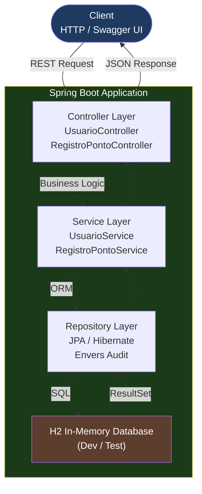
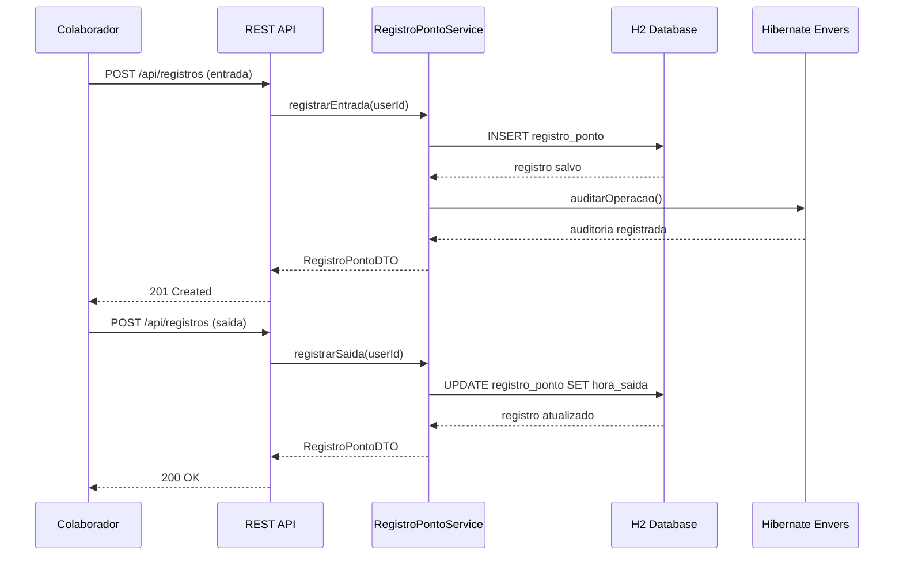

# Controle de Ponto e Acesso com Spring Boot | Time and Access Control with Spring Boot

[](https://www.oracle.com/java/technologies/javase/17-ea-downloads.html)
[](https://spring.io/projects/spring-boot)
[](https://opensource.org/licenses/MIT)
[](Dockerfile)

---

## Sobre o Projeto | About

**PT-BR:** API REST robusta para controle de ponto e acesso de colaboradores, desenvolvida com **Spring Boot** como parte do **Santander Bootcamp Fullstack**. Permite o gerenciamento de usuarios, registros de ponto e auditoria de operacoes.

**EN:** A robust REST API for employee time and access control, built with **Spring Boot** as part of the **Santander Bootcamp Fullstack**. Supports user management, time record tracking and operation auditing.

---

## Arquitetura | Architecture



---

## Ciclo de Registro de Ponto | Time Record Lifecycle



---

## Funcionalidades | Features

| Endpoint | Metodo | Descricao | Description |
|----------|--------|-----------|-------------|
| `/api/usuarios` | `POST` | Cadastrar novo usuario | Register new user |
| `/api/usuarios` | `GET` | Listar todos os usuarios | List all users |
| `/api/usuarios/{id}` | `GET` | Buscar usuario por ID | Get user by ID |
| `/api/registros` | `POST` | Registrar ponto (entrada/saida) | Clock in/out |
| `/api/registros/{userId}` | `GET` | Listar registros do usuario | Get user time records |
| `/swagger-ui.html` | `GET` | Documentacao interativa | Interactive API docs |

---

## Tecnologias | Tech Stack

- **Java 17+**
- **Spring Boot 3.x**
- **Spring Data JPA** — persistencia e acesso a dados
- **Hibernate Envers** — auditoria automatica de entidades
- **Lombok** — reducao de codigo boilerplate
- **Swagger / OpenAPI (springdoc)** — documentacao interativa
- **H2 Database** — banco em memoria para desenvolvimento e testes

---

## Estrutura do Projeto | Project Structure

```
src/
└── main/
    ├── java/
    │   └── com/galafis/controleponto/
    │       ├── controller/          # REST Controllers
    │       ├── model/               # Entities / DTOs
    │       ├── repository/          # JPA Repositories
    │       ├── service/             # Business logic
    │       └── ControlePontoApplication.java
    └── resources/
        └── application.properties   # App configuration
```

---

## Como Executar | Getting Started

**PT-BR**

Pre-requisitos: JDK 17+ e Maven instalados.

1. Clone o repositorio:
   ```bash
   git clone https://github.com/galafis/Construindo-um-Sistema-de-Controle-de-Ponto-e-Acesso-com-Spring-Boot
   cd Construindo-um-Sistema-de-Controle-de-Ponto-e-Acesso-com-Spring-Boot
   ```

2. Compile e execute:
   ```bash
   ./mvnw spring-boot:run
   ```

3. Acesse a documentacao do Swagger:
   ```
   http://localhost:8080/swagger-ui.html
   ```

4. Acesse o console do banco H2:
   ```
   http://localhost:8080/h2-console
   ```

**EN**

Prerequisites: JDK 17+ and Maven installed.

1. Clone the repository:
   ```bash
   git clone https://github.com/galafis/Construindo-um-Sistema-de-Controle-de-Ponto-e-Acesso-com-Spring-Boot
   cd Construindo-um-Sistema-de-Controle-de-Ponto-e-Acesso-com-Spring-Boot
   ```

2. Build and run:
   ```bash
   ./mvnw spring-boot:run
   ```

3. Access Swagger documentation:
   ```
   http://localhost:8080/swagger-ui.html
   ```

4. Access H2 console:
   ```
   http://localhost:8080/h2-console
   ```

---

## Exemplo de Uso | Usage Example

```bash
# Create a user / Cadastrar usuario
curl -X POST http://localhost:8080/api/usuarios \
  -H "Content-Type: application/json" \
  -d '{"nome": "Gabriel Lafis", "email": "gabriel@empresa.com", "cargo": "Analista"}'

# Clock in / Registrar entrada
curl -X POST http://localhost:8080/api/registros \
  -H "Content-Type: application/json" \
  -d '{"usuarioId": 1, "tipo": "ENTRADA"}'

# Get time records / Consultar registros
curl -X GET http://localhost:8080/api/registros/1
```

---

## Observacoes | Notes

**PT-BR**
- O Hibernate Envers esta configurado para auditar automaticamente todas as operacoes nas entidades.
- O banco H2 e temporario e reinicia ao parar a aplicacao (ideal para desenvolvimento e testes).
- A documentacao Swagger oferece uma interface interativa para explorar e testar todos os endpoints.

**EN**
- Hibernate Envers is configured to automatically audit all entity operations.
- The H2 database is temporary and resets on application restart (ideal for development and testing).
- Swagger documentation provides an interactive interface to explore and test all endpoints.

---

## Sobre o Autor | About the Author

**Gabriel Demetrios Lafis** — Cientista de Dados com interesse em desenvolvimento back-end moderno, APIs escaláveis e sistemas distribuídos.

[](https://github.com/galafis)

---

## Licenca | License

Este projeto esta sob a licenca MIT. Veja o arquivo [LICENSE](LICENSE) para mais detalhes.

This project is licensed under the MIT License. See the [LICENSE](LICENSE) file for details.


---

## English

### Overview

Controle de Ponto e Acesso com Spring Boot | Time and Access Control with Spring Boot - A project built with Java, HTML, SQL, Spring Boot, developed by Gabriel Demetrios Lafis as part of professional portfolio and continuous learning in Data Science and Software Engineering.

### Key Features

This project demonstrates practical application of modern development concepts including clean code architecture, responsive design patterns, and industry-standard best practices. The implementation showcases real-world problem solving with production-ready code quality.

### How to Run

1. Clone the repository:
   ```bash
   git clone https://github.com/galafis/Construindo-um-Sistema-de-Controle-de-Ponto-e-Acesso-com-Spring-Boot.git
   ```
2. Follow the setup instructions in the Portuguese section above.

### License

This project is licensed under the MIT License. See the [LICENSE](LICENSE) file for details.

---

Developed by [Gabriel Demetrios Lafis](https://github.com/galafis)
